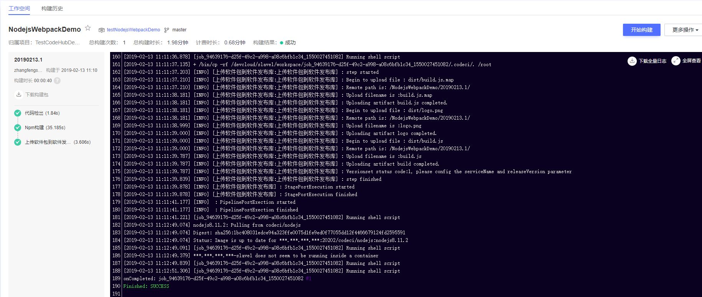
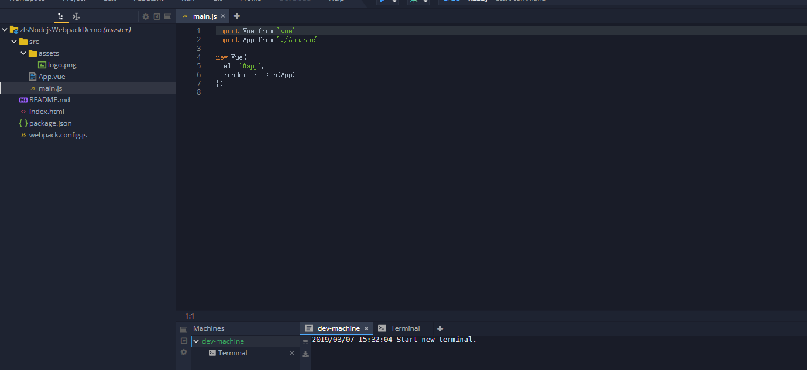
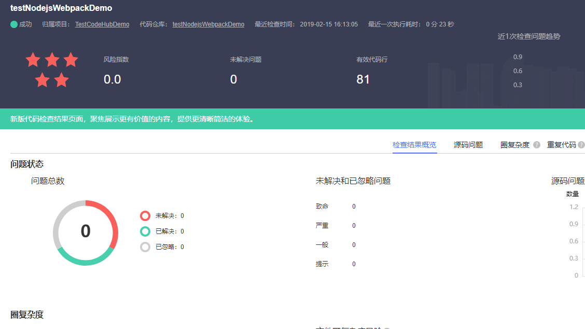

### 该项目用于Tekton构建使用，详情请点击https://lomtom.cn

基于webpack编译的vue框架工程，实现简单的页面显示。。
使用NPM模板进行构建
使用语言 nodejs
编译工具 nodejs8.11.2

编译命令：
#设置镜像仓加速构建
npm config set registry https://mirrors.huaweicloud.com/repository/npm/
#加载依赖
npm install
#默认构建
npm run build

* 构建结果

## 流水线相关

- 是否支持自动创建流水线：**不支持**

- 流水线配置结构

> 开始阶段
+ 源码仓库

> 编译阶段
+ 构建任务
+ 代码检查任务

> 部署阶段
+ 部署任务
+ 接口测试任务

## CloudIDE相关

- 是否支持在CloudIDE导入：**支持**

* 导入结果

## CloudCheck相关

* 检查结果

